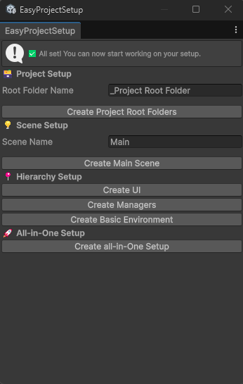
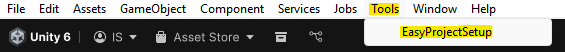

# 🧩 EasyProjectSetup for Unity

---

## 🚀 Overview

**EasyProjectSetup** is a Unity Editor tool that lets you **instantly create a clean, organized project structure** and **base scene** with one click.  
It’s designed for developers who want to start new projects faster, with a consistent hierarchy, ready-made folders, and essential objects.

**Key Features:**
- 📁 Auto-create standard project folders (`Scenes`, `Scripts`, `Prefabs`, `Materials`, `Textures`)
- 🪟 Auto-generate base scene (`Main.unity`)
- 💡 Adds Directional Light, Main Camera, and Post-Processing Volume
- 🖥️ Creates UI Canvas & EventSystem
- ⚙️ Includes basic Managers and Environment objects
- 🧩 Works in both URP and HDRP (with volume profile auto-setup)
- 🪶 Lightweight and easy to customize

---

## 📦 Installation

### Option A — Install via Unity Package Manager (Git URL)

1. Open **Unity → Window → Package Manager**
2. Click **+** → **Add package from Git URL**
3. Paste the following:
https://github.com/IreshSampath/unity-tools-easy-project-setup.git
4. Click **Install**

---

## 🧰 Quick Start

### ✅ Step 1 — Open the Tool
1. In Unity, go to **Tools → EasyProjectSetup**
2. The **Project Setup Tool** window will appear in the Editor
   

### ✅ Step 2 — Create Root Folders
1. Enter your custom root folder name (default: `_Project Root Folder`)
2. Click **Create Project Root Folders**
3. The following structure will be created:

Assets/
└── _Project Root Folder/
├── Scenes/
├── Scripts/
├── Prefabs/
├── Materials/
└── Textures/

### ✅ Step 3 — Generate Base Scene
Click **Create Main Scene** to automatically generate:
- Empty base scene  
- Auto-saved scene 

### ✅ Step 4 — Add Hierarchy Elements
Use the extra buttons to add:
- **Create UI** → Adds Canvas & EventSystem  
- **Create Managers** → Adds AppManager & UIManager placeholders  
- **Create Basic Environment** → Adds Environment root, lighting, and camera setup  
- **Create All-in-One Setup** → Builds everything together

---

## ⚙️ Example Workflow
| Action | Result |
|--------|---------|
| Create Project Root Folders | Sets up base folders |
| Create Main Scene | Generates and saves base scene |
| Create UI | Adds Canvas and EventSystem |
| Create Managers | Adds App and UI Manager GameObjects |
| Create Basic Environment | Adds light, camera, and post-processing |
| Create All-in-One Setup | Does everything above automatically |

---

## 📜 License
This project is licensed under the **MIT License** — free for both commercial and personal use.

---

## 🙏 Thank You
Thanks for using **EasyProjectSetup**!  
If this helped speed up your workflow, consider giving it a ⭐ on GitHub or contributing improvements.

---

## 👤 Author
**Iresh Sampath**  
🔗 [LinkedIn Profile](https://www.linkedin.com/in/ireshsampath/)
